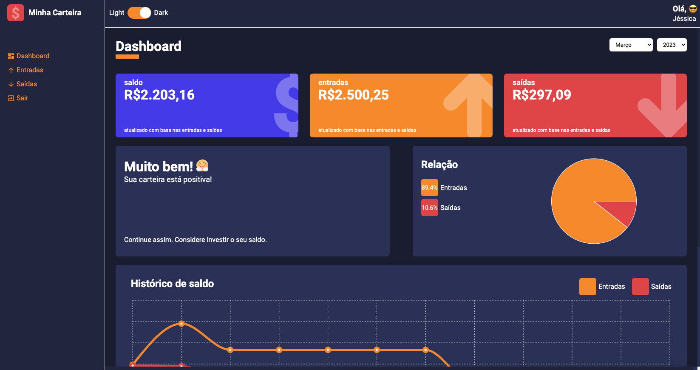

## 💵 MINHA CARTEIRA DASHBOARD



Dashboard criado para controle financeiro desenvolvido utilizando ReactJs e TypeScript. Criação de um layout responsivo com Grid Layout e Flexbox.

<a href="https://www.figma.com/file/nOGmUkhcINJt6nd57R4ENu/Minha-Carteira?type=design&node-id=0-1&mode=design&t=YPhsaZk6CLCalZXS-0">

</a>

## 🛠️ Stack

Este projeto foi desenvolvido com as seguintes tecnologias:

- React
- Typescript
- Styled-components
- React-router-dom
- Recharts
- React-icons
- React-switch
- localStorage
- React-countup

## ⚙️ O que o app faz?

- Criação de usuário
- Autenticação de usuário
- Listar entradas e saídas cadastradas
- Mostrar gráficos de entradas e saídas

## [](https://github.com/JessicaLopesDev/Dashboard-Financial-Charts) 🚀 Como executar o projeto

#### 🧭 Rodando a aplicação

```bash

# Clone o repositório

$ git clone https://github.com/JessicaLopesDev/Dashboard-Financial-Charts.git

# Acesse a pasta do projeto

$ cd Dashboard-Financial-Charts

# Instale as dependências

$ yarn

# Execute a aplicação

$ yarn start

```
